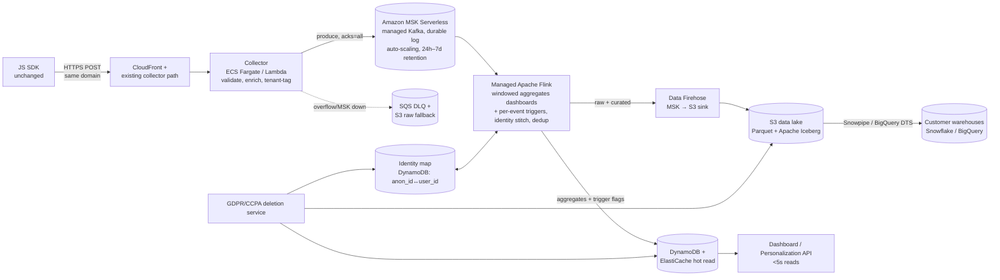

# Engineer-004: Real-Time Analytics Pipeline

**Brief:** rebuild a 50M-events/day martech analytics pipeline to cut latency from 15–30 min to under 5s, eliminate the ~3% loss during spikes, stay multi-tenant (500+ customers) and SOC2/GDPR/CCPA-compliant, on AWS, under $50K/mo, with 2 senior engineers, MVP in 3 months, and no SDK breaking change.

**Recommendation:** a durable log (**Amazon MSK Serverless**, managed Kafka) feeds Managed Flink, which writes aggregates to a hot store (DynamoDB/Redis) for dashboards and, in parallel, lands raw and curated data in an S3/Iceberg lake for warehouse export and GDPR deletes. This is greenfield: the team has no streaming layer today (their stack is Python/Node/Postgres/Redis). Two calls drive the design, both defended in §1: the **Kafka API** over Kinesis (open standard, no lock-in, plus the Kafka Connect / Schema Registry ecosystem we'd use anyway, and the contract enforcement matters because we can't push schema changes into the SDK), and **Serverless over provisioned** (the brief's core pain is surviving spikes, and provisioned brokers force me to over-size for peak or rebalance mid-spike, exactly when I can least afford it). Migration is a strangler-fig dual-write with per-tenant cutover and a routing flag for instant rollback. The binding constraints are latency, zero loss, and compliance, not budget; the model lands near $4.3K/mo, well under $50K.

> **Operating artifact:** `artifact/` has four runnable scripts that produce the numbers below (`run_all.sh`; captured output in `sample_output/`). Every number carries a source label (Observed / Estimated / Benchmarked / Assumed).

---

## 1. Architecture & Technology Choices

**Data flow.** The JS SDK keeps posting to the existing collector endpoint unchanged (same hostname/path, same JSON schema, additive fields only), so deployed SDKs need no redeploy and all new behavior is server-side. The collector validates, enriches, and tenant-tags each event, then produces to MSK; Flink sessionizes, stitches identity, and writes aggregates to DynamoDB/Redis while Firehose lands raw and curated events in S3/Iceberg.

**Why these choices (and what I rejected):**

| Component | Choice | Why |
|---|---|---|
| Buffer | Amazon MSK **Serverless** (managed Kafka) | Open standard (no lock-in) plus the ecosystem we'd use anyway (Connect for sinks, Schema Registry to enforce the event contract), and Serverless auto-scales throughput so a 10× spike needs no broker resize, directly answering the brief's spike-crash pain. Provisioned MSK is cheaper at steady state but resizes brokers under load (a rebalance at the worst moment); Kinesis cuts ops more and is fully native, but is proprietary (lock-in). Greenfield either way: no streaming platform exists today. Validated on a real 3-node Kafka cluster at RF=3/ISR=2 (`broker_bench.py`). |
| Processing | Managed Apache Flink | Event-time windowing, sessionization, and checkpointed state, with no cluster to run. End-to-end I rely on idempotent **effectively-once** writes (`event_id` dedup into DynamoDB), not transactional exactly-once: the DynamoDB sink isn't transactional with Flink checkpoints, so I don't claim it. Lambda+DynamoDB is the month-1 stopgap but turns sessionization into hand-rolled state; Spark adds a micro-batch latency floor. |
| Serving | DynamoDB + ElastiCache/Redis | Single-digit-ms reads, multi-tenant via a `tenant_id` partition key. An OLAP store (ClickHouse/Druid) can come later behind the same API for ad-hoc queries. |
| Lake/export | S3 + Apache Iceberg, Firehose | Iceberg gives row-level deletes (needed for GDPR), schema evolution, and audit history. Snowpipe and BigQuery Transfer read straight from S3. |
| Identity | DynamoDB anon_id↔user_id map | O(1) lookups, and deterministic rather than probabilistic so the mapping stays GDPR-defensible. |

**Event envelope & stitching.** `{event_id (uuid, idempotency key), tenant_id, anonymous_id, user_id?, event_type, ts_client, ts_ingest, context{}, properties{}}`. The collector stamps `ts_ingest` and sets `tenant_id` from the write credential, so a client can't spoof tenancy. On an `identify` event we map `anon_id→user_id` and Flink back-attributes the session; stitching is **deterministic only**, which is GDPR-defensible but won't link a user across devices until they identify, a limit I accept over probabilistic matching. Dedup rests on the idempotent conditional write keyed by `event_id` into DynamoDB, so an SDK retry (at-least-once delivery) overwrites rather than double-counts; a per-window seen-set in Flink is the cheap fast-path in front of it.

---

## 2. Scale, Reliability, Compliance & Migration

**Zero loss at 50M/day and 10× spikes** (≈578 ev/s average, ~5.8K/s at peak; both Estimated), meaning zero loss *once the collector durably accepts an event*. Three layers: (1) producers write to MSK with `acks=all` and `min.insync.replicas≥2`, and consumers replay from retention, so slow processing shows up as lag, not loss; (2) the collector applies backpressure instead of dropping. `pipeline_sim.py` shows the naive synchronous-write model shedding ~67% of events under a 10× spike (p99 ~2.1 s) versus 0.0% for the buffered model at p99 ~175 ms *(Observed, simulated; absolute latency varies run-to-run)*; (3) if MSK is unreachable, the collector spills to SQS/S3 and never acks the SDK until the event is durable. The 10× peak is ≈5.8 MB/s of ingest (5.8K/s × ~1 KB), far inside MSK Serverless's ~200 MB/s per-cluster ingress quota *(Benchmarked, re-verify)*, so "auto-scaling" here means staying within Serverless limits, not exceeding them. The one residual is the browser→collector hop itself (a beacon lost to tab-close or a dropped connection before our ack), which we can't close without an SDK change the brief forbids; I treat it as a bounded residual caught by per-tenant volume anomaly detection, not a loss I claim away.

On a real 3-node cluster (Redpanda, same Kafka API as MSK, `acks=all` + `replication_factor=3`/`min.insync.replicas=2`, so a write isn't acked until ≥2 replicas hold it): paced 6K eps gives 0 loss, p50 ~5–15 ms, p99 ~0.35 s; an overload burst (~28K eps into one consumer) still gives 0 loss, p99 ~1.0–1.2 s. That burst latency includes client-side send-buffer queueing, so it's an upper bound, not broker lag *(Observed, local, RF=3; laptop-bound, varies run-to-run)*. Flink parallelism removes the single-consumer tail.

**Two latency paths** *(Estimated)*. *Dashboards (≤5 s):* collector ≤50 ms + MSK ≤200 ms + Flink window 1–2 s + DynamoDB ≤50 ms; the window dominates and we tune it per metric (1 s for counters, longer for sessions). *Personalization triggering needs sub-second*, so it does **not** wait on the windowed path: a lightweight event-driven Flink operator emits per-event signals (e.g. "viewed pricing 3×") on arrival and writes a flag to the DynamoDB/Redis hot store the personalization API reads. One log, two consumers: windowed for analytics, event-time for triggers. **Segmentation** rides the same split: coarse behavioral segments (e.g. `active-7d`, `cart-abandoner`) are membership flags Flink keeps in the hot store for the dashboard/segmentation API to read directly, while richer pattern-based segments are recomputed by a scheduled job over the Iceberg lake and written back, keeping the expensive query off the hot path. Both key on `tenant_id` for isolation.

**SOC 2 & compliance.** Encryption in transit (TLS) and at rest (KMS) across MSK, DynamoDB, and S3; centralized audit logging (CloudTrail plus app-level access logs); least-privilege IAM scoped per tenant. GDPR/CCPA deletes run through a deletion service that fans out to every sink behind a completion ledger, with Iceberg doing the row-level erase in the lake.

**Migration (strangler-fig).** Phase 0 (wk 1–2): the collector dual-writes to MSK; the old pipeline stays authoritative and the new one runs in shadow, with no SDK or customer change. Phase 1 (wk 3–6): reconcile new against old, dark-launch new dashboards. Phase 2 (mo 2–3): a `tenant→pipeline` flag cuts tenants over one cohort at a time, lowest-risk first. Rollback is flipping the flag back, since the old pipeline runs until the last tenant moves; we decommission after a clean billing cycle.

**Accuracy validation.** Per-tenant per-minute count reconciliation, old vs new (alert above 0.1% divergence, Assumed); idempotent dedup on `event_id`; per-session gap checks; and periodic recompute of serving aggregates from the Iceberg lake, which is the system of record. The GDPR demo measures this: the lake goes 60,000 → 59,940 rows after erasing a user's 60 rows spread across 7 of 350 partition files, with the other 343 files byte-for-byte identical (sha256) *(Observed)*.

**Cost** *(Estimated from Benchmarked prices + Assumed volumes)*: ~$4,262/mo baseline and ~$12,026/mo in a sustained 10× month, both well under $50K. With MSK Serverless the spike shows up as an automatic per-GB throughput surge, not a manual broker change: elasticity I pay a little for at baseline, and exactly what survives the spike. With this much headroom, budget is the constraint I worry about least.

---

## 3. Trade-offs & Risks

**What I optimize for, and give up.** I optimize for an open standard (portability, ecosystem) and zero loss. Costs accepted: a bit more ops and spend than Kinesis (mitigated by MSK Serverless's auto-scaling and ~$45K of headroom); latency at the 5s SLO on the *dashboard* path rather than sub-500 ms, since correct sessionization costs latency (the personalization path stays sub-second, §2); and no OLAP in the MVP, deferred behind the same API.

**Failure modes.** Hot tenant or partition: detect via per-tenant lag, mitigate with composite keys (`tenant_id#bucket`) and collector rate limits. A bad `identify` corrupting a session: deterministic-only stitching, an append-only audited map, and replay to correct. `event_id` not unique (an SDK bug we can't fix): dedup degrades, so watch a duplicate-rate metric. A GDPR delete missing a copy: the completion ledger plus short MSK retention, with warehouse copies made a DPA obligation. Migration divergence hiding a bug: hard-fail the cutover gate above 0.1%.

**With more time:** add ClickHouse for ad-hoc queries, enforce a schema registry at the collector, benchmark MSK Serverless against provisioned on real traffic (provisioned may be cheaper once load is steady and predictable), and load-test on AWS before quoting production SLAs.

---

## Required Submission Packet

### Evidence Log (claims → proof tier)
Tiers per the repo `SCORING.md` (0 none, 1 screenshot, 2 demo artifact, 3 logs/exports, 4 before/after benchmark, 5 independent verification).

| # | Claim | Evidence | Tier |
|---|---|---|---|
| 1 | Buffering turns spike-time loss (current ~3%) into bounded latency | `pipeline_sim.py`: ~67% → 0.0% loss under a 10× spike; output captured. A before/after, but of an in-process *model*, not the real system | 2–3 (model) |
| 2 | Zero loss holds on a real replicated log under overload | `broker_bench.py` on a 3-node Redpanda cluster, `acks=all` + ISR=2: 0 loss paced *and* burst; paced p50 ~5–15 ms | 3–4 |
| 3 | A single-user GDPR delete erases the subject and touches nothing else | `gdpr_delete_demo.py` on real Parquet: 60→0 subject rows across 7 files; only 7/350 files rewritten; 343/343 untouched files sha256-identical | 3 |
| 4 | The design fits the $50K/mo budget with headroom | `cost_model.py` bottom-up: ~$4.3K baseline / ~$12.0K sustained-10× | 2 (model) |
| 5 | Both latency paths (dashboard ≤5 s, personalization sub-second) hit target | Component estimate (§2) | 0–1 (estimate, not measured on AWS) |
| 6 | The migration is reversible | Strangler-fig design plus routing flag (§2); design, not yet executed | 0 |

**Honest gaps:** claims 5–6 are design-level, not benchmarked. Nothing ran on real AWS; the broker numbers come from a local 3-node Kafka-API cluster (proves the replication mechanism, not AWS capacity), labeled as such. I did not load-test 50M/day end to end; I tested the mechanism at a scaled volume.

### Number Source Labels
| Number | Label |
|---|---|
| Events/day, ~3% current loss, 15–30 min latency, $50K budget, team size | Assumed (given in brief) |
| Avg event 1 KB, agg-write fraction 20%, lake 12 TB, export 8 TB/mo, 0.1% divergence gate | Assumed (my modeling inputs) |
| 578 ev/s avg, 5.8K/s at 10×, latency budget sum, cost totals | Estimated (computed) |
| AWS unit prices (MSK Serverless $/cluster-hr, $/partition-hr, $/GB in-out; $/KPU-hr; $/GB), us-east-1, 2026-06 | Benchmarked (pricing pages; verify, prices drift) |
| Sim loss/latency, Redpanda loss/latency/throughput, GDPR row counts | Observed (measured locally, not on AWS) |

### AI Usage Disclosure
I used Claude Code (Anthropic) heavily and want to be precise about who did what.
- **AI (most of the build):** wrote and debugged the four scripts and drafted this document. It also caught its own bugs mid-session. The clearest example: a broker benchmark that produced all events then consumed them, inflating latency to ~1 s; running the producer and consumer concurrently exposed the real single-digit-ms p50. It also fixed a pyarrow partitioning error. Those were AI fixes.
- **Me:** framed the problem; chose the artifact strategy (a runnable sim, a real 3-node broker, a real GDPR delete, not a doc-only answer); ran the scripts and confirmed they produce the labeled outputs; reviewed for honest claims and source labels. On the broker decision: the AI's first draft led with Kinesis; I overrode it to the Kafka API for its open-standard and ecosystem merits, and because I personally have the Kafka depth to operate it. I then caught my own bias: I'd initially specified *provisioned* MSK, the worst posture for the brief's spike-crash pain, and corrected it to **MSK Serverless** (keep the Kafka API, drop the broker-resize-under-load failure mode). I then hardened the broker test from a single node to a 3-node RF=3/ISR=2 cluster so it actually proves the durability the zero-loss claim rests on.
- **Prices verified (2026-06-30):** I checked every `cost_model.py` unit price against the live AWS pricing pages. MSK Serverless, Flink, Firehose, S3, Fargate, and ElastiCache ($150.38/mo ÷ 730 = $0.206/hr) all confirmed; I corrected DynamoDB on-demand down (it had the pre-2024 rate; the 50% cut brought writes to $0.625/M, dropping the total from ~$4.6K to ~$4.3K). Prices still drift, so re-check before quoting a contract.
- **I own and can defend:** MSK Serverless (Kafka API for the open standard + ecosystem, Serverless for spike elasticity) over both provisioned MSK and Kinesis; Flink over Lambda; the split dashboard/personalization latency paths; deterministic stitching; per-tenant cutover with rollback. The numbers are real local measurements; I claim the model, not AWS-production SLAs.

### What Breaks It
- The SDK truly can't change: if `event_id` isn't unique, dedup is best-effort. The biggest risk, and outside our control.
- A tenant 100× the others breaks the even-distribution assumption behind the cost and latency models.
- Cost assumes ~1 KB events; 5 KB events multiply the ingest lines ~5× (still under budget, but verify).
- Local benchmarks aren't AWS: network and multi-AZ replication move the numbers. Mechanism-proof, not capacity-proof.
- Warehouse and backup copies are the easiest place for a GDPR delete to silently miss.

### What Stays Human
- Per-tenant cutover sign-off: an auto-cutover on a green-but-wrong metric corrupts 500 customers at once.
- GDPR erasure at scale: behind a reviewed ledger, with human approval for bulk and legal-hold cases.
- The MSK-Serverless-vs-Kinesis-vs-provisioned call: tied to hiring, ops appetite, and lock-in tolerance, a leadership decision I'd revisit after a real load test.
- Decommissioning the old pipeline: only after a human confirms a clean billing cycle.
